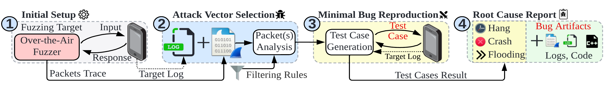

# AirBugCatcher: Automated Wireless Reproduction of IoT Bugs

AirBugCatcher is a tool to automatically and reliably reproduce wireless protocol vulnerabilities. The capability of AirBugCatcher complements the wireless security testing pipeline. AirBugCatcher is evaluated on wireless protocols such as Bluetooth Classic (BR/EDR), 5G NR and Wi-Fi. Nonetheless, the approach embodied within AirBugCatcher targets arbitrary wireless protocol implementations. The methodology empowering the AirBugCatcher tool appears in the 40th Annual Computer Security Applications Conference (ACSAC), 2024. 

<div style="text-align: center;">

</div>

This repository contains implementation for AirBugCatcher written in Python. More details can be found in [AirBugCatcher Paper](https://asset-group.github.io/papers/airbugcatcher.pdf).

[AirBugCatcher artifacts paper](images/AirBugCatcher_Artifact.pdf) received the following badges in the Annual Computer Security Applications Conference (ACSAC) 2024:
<div align="center" style="text-align: center;">
  
  
</div>

---

**Table of Contents**
- [Requirement](#requirement)
  - [Hardware](#hardware)
  - [Software](#software)
- [Setup](#setup)
- [Repository Structure](#repository-structure)
- [Evaluation Workflow](#evaluation-workflow)
- [Advanced Usage](#advanced-usage)
  - [Test Other Targets](#test-other-targets)
    - [Prepare Fuzzing Logs](#prepare-fuzzing-logs)
    - [Prepare Exploiter](#prepare-exploiter)
    - [Run AirBugCatcher](#run-airbugcatcher)
- [References](#references)
- [Citing AirBugCatcher](#citing-airbugcatcher)

# Requirement

## Hardware

The application of AirBugCatcher involves interactions with hardwares such as ESP32, Cypress boards, etc. The tested hardwares may need to be flashed with certain vulnerable versions of firmware. The details of the firmware versions can be found in the [AirBugCatcher paper](https://asset-group.github.io/papers/airbugcatcher.pdf) and the instructions for firmware flashing can be found in [braktooth](https://github.com/Matheus-Garbelini/braktooth_esp32_bluetooth_classic_attacks). We recommend using a machine with at least four cores, 8GB memory and 40 GB disk space to run AirBugCatcher and the related experiments. The target devices (more details in the paper) need to be connected as well to run the experiments.

## Software

AirBugCatcher is utilizing a fuzzing tool WDissector \[1\] and our research team developing WDissector has made the tool publicly available at: https://hub.docker.com/r/megarbelini/5ghoul. The paper and artifacts are available at https://www.usenix.org/conference/usenixsecurity22/presentation/garbelini. Note that this Docker image contains everything needed for Bluetooth, Wi-Fi and 5G fuzzing.

AirBugCatcher is purely written in Python. While AirBugCatcher is developed using Python 3.12.3 on Ubuntu, it should run smoothly for Python version >= 3.8. A list of Python package dependencies can be found in `requirements.txt`.

# Setup

It is strongly recommended to setup AirBugCatcher within the WDissector Docker image because AirBugCatcher needs to invoke WDissector. We have provided the scripts to automatically setup the Docker image and AirBugCatcher and the scripts can be found in `setup_container.sh` and `setup_airbugcatcher.sh`. The scripts are tested on Ubuntu 22.04 only. 

To run the setup scripts, the following steps are provided for reference only:
```bash
# Setup container
wget "https://anonymous.4open.science/api/repo/air-bug-catcher-E5C2/file/setup_container.sh?v=cdcc5417&download=true" -O setup_container.sh
bash setup_container.sh

# Now the container is setup with name airbugcatcher_eval
sudo podman exec -it airbugcatcher_eval bash

# Note: Execute the following lines in the container!
wget "https://anonymous.4open.science/api/repo/air-bug-catcher-E5C2/file/setup_airbugcatcher.sh?v=817247ae&download=true" -O setup_airbugcatcher.sh
bash setup_airbugcatcher.sh
```

After the setup scripts finish, AirBugCatcher and WDissector are setup in the container called `airbugcatcher_eval` and experiments are ready to run!

**More About Wi-Fi Dongle**

In our evaluation of Wi-Fi target implementation bugs, a kernel module is needed for the ALFA AWUS036AC dongle to function. To compile the kernel module, we can first copy its source code from the container to the host. Subsequently, the source code needs to be compiled and the module needs to be loaded on the host. The following steps illustrate the overall process:

```bash
# The following scripts are to be run on the host instead of the container.
sudo podman exec -it airbugcatcher_eval tar -czf rtl8812au.tar.gz -C /home/user/wdissector/src/drivers/wifi/ rtl8812au/
podman cp airbugcatcher_eval:/home/user/wdissector/rtl8812au.tar.gz /tmp
cd /tmp
tar -xzf rtl8812au.tar.gz
cd rtl8812au
sudo apt install build-essential
make

# load kernel module required by the Wi-Fi dongle
sudo bash load.sh
```

*It is worthwhile to mention that the kernel module required by ALFA AWUS036AC Wi-Fi dongle is slightly unstable on our machine and can sometimes make the system unresponsive.*

# Repository Structure

AirBugCatcher is a typical Python application. Some helper scripts to run the evaluations in the paper and generate the corresponding statistics are also included. More specifically, the structure is as follows:


- **AirBugCatcher Code**
    - Folder `exploiter/` contains the logic to automatically generate and run the the exploit for a certain target. The logic for different targets are organized into respective Python files.
    - Folder `exploit_templates/` contains the template C++ exploit codes which are used in the **exploit generation** stage of AirBugCatcher.
    - Folder `fuzzlog/` contains the logic to analyze the logs (packet trace and target log). The logic for different targets are organized into respective Python files.
    - File `__init__.py`.
    - File `auto_exploiter.py` controls the overall logic of AirBugCatcher, such as number of fuzzed packets in the exploit or the test timeout.
    - File `constants.py` contains the settings for cache and log folder.
    - Files `utils.py` and `utils_wdissector.py` contains utility functions for AirBugCatcher.
- **Evaluation Helper Scripts**
    - Folder `eval_scripts/` contains the helper scripts to run the evaluations of research questions (RQs) and generate the corresponding statistics.
    - Files `run_rq1.sh`, `run_rq3.sh`, `run_rq4.sh`, `run_rq5.sh` and `run_utils.sh` are helper scripts to run the evaluations.
    - File `run_rq_progress.sh` is used to show the progress when running either of `run_rq1.sh`, `run_rq3.sh`, `run_rq4.sh` and `run_rq5.sh`.
- **Setup Scripts**
    - File `setup_container.sh` helps setup Podman and WDissector container.
    - File `setup_airbugcatcher.sh` helps to setup the environment and AirBugCatcher inside the WDissector container.
- **Dataset**\
    *Note: The two datasets we provided are compressed using LZMA for better compression ratio. To extract the files, command `tar --lzma -xvf file.tar.lzma` can be useful.*
    - File `captures.tar.lzma` contains the fuzzing logs of the targets during our evaluations.
    - File `our_results.tar.lzma` contains the evaluation results during our experiments.
- **Miscellaneous**
    - Folder `images/` contains the images used by documentations.

# Evaluation Workflow

The evaluations can be conducted in the same order as the research questions (RQs) in the [AirBugCatcher paper](https://asset-group.github.io/papers/airbugcatcher.pdf). Overall, the entire evaluation takes about 175 hours to complete across all devices. Such a duration stems from the large number of different experiments conducted on five subject devices. We note that the evaluations of different devices can be carried out in parallel. This can significantly speed up the evaluation process. In each RQ, the experiments are conducted in the following sequential order: ESP32-WROOM-32, CYW920735Q60EVB-01, OnePlus Nord CE 2, SIMCom SIM8202G-M.2 and ESP-WROVER-KIT. For the scripts and logs provided with this artifact, the five devices may also be referred as esp32_bt, cypress_bt, oneplus_5g, simcom_5g and esp32_wifi, respectively for simplicity.


We have provided the helper scripts to run the experiments for RQs in the paper, named `run_rq1.sh`, `run_rq3.sh`, `run_rq4.sh` and `run_rq5.sh` for RQ1, RQ3, RQ4 and RQ5 respectively. *RQ2 experiment has the same setup as RQ1, meaning that the results of RQ2 can be derived from RQ1 results*. **Thus**, to run the experiments for RQ2, simply utilize the script for RQ1: `run_rq1.sh`. The logs of the experiments are stored in `/home/user/wdissector/modules/airbugcatcher/eval_results`. We currently output experiment logs to files instead of standard output (stdout). There are two kinds of log files: (i) detailed log file containing the output from both AirBugCatcher and WDissector, which may be very large (ii) dedicated log files containing only AirBugCatcher output, which is neat and only shows the information like which test case is executing and what bug is triggered. For instance, when running RQ1 experiments, the detailed log for Bluetooth target ESP32-WROOM-32 is stored in `/home/user/wdissector/modules/airbugcatcher/eval_results/RQ1/esp32_bt/esp32_bt_rq1.log` and the location of the dedicated log file is indicated in the *first line* of the detailed log. Sample logs for Bluetooth target ESP32-WROOM-32 in RQ1 can be found in the file `our_results.tar.lzma`.


At the end of each RQ evaluation, the statistics will be generated and shown on the screen.


**Evaluation Progress**

While it takes a long time to run all the evaluations, we provide a helper script to show the progress of the evaluation process. Simply run `bash run_rq_progress.sh` in a new window (inside AirBugCatcher folder) when running either of `run_rq1.sh`, `run_rq3.sh`, `run_rq4.sh` and `run_rq5.sh`.


**Run Experiment Against One Device Only**

To run our tool on one target only, we need to first prepare the configuration files for the target, then run the experiments. The configuration files for different protocols are different and the related commands to change the configuration files can be found in file `/home/user/wdissector/modules/airbugcatcher/run_utils.sh`. Moreover, the scripts to run experiments on each device for each research question (RQ) can be found in the folder `/home/user/wdissector/modules/airbugcatcher/eval_scripts`.

For instance, to run RQ1 on Bluetooth target ESP32-WROOM-32 only, the following command can be used:

```bash
cd /home/user/wdissector/modules/airbugcatcher
cp eval_scripts/wdissector_configs/esp32_bt/global_config.json /home/user/wdissector/configs/global_config.json
cp eval_scripts/wdissector_configs/esp32_bt/bt_config.json /home/user/wdissector/configs/bt_config.json
source .venv/bin/activate
python -m eval_scripts.RQ1.esp32_bt.esp32_bt_rq1
```

**Generate Statistics Using Our Results**

We include the original logs from our evaluation in the file `our_results.tar.lzma`. We have also provided the following scripts to help generate the statistics for RQ1 to RQ5 automatically.

```bash
cd /home/user/wdissector/modules/airbugcatcher
source .venv/bin/activate
# Generate RQ1 statistics, Table 4 in the paper
python -m eval_scripts.analyze_rq1_results our_results/RQ1
# Generate RQ2 statistics, R2 statistics generation is utilizing RQ1 results
# Figure 6 in the paper
python -m eval_scripts.analyze_rq2_results our_results/RQ1
# Generate RQ3 statistics, Table 5 in the paper
python -m eval_scripts.analyze_rq3_results our_results/RQ3
# Generate RQ4 statistics, Table 6 in the paper
python -m eval_scripts.analyze_rq4_results our_results/RQ4
# Generate RQ5 statistics, Section 5, RQ5 in the paper
python -m eval_scripts.analyze_rq5_results our_results/RQ5
```

We have provided the following script to analyze the fuzzing logs from target devices and generate statistics, as shown in Table 3 of the [AirBugCatcher paper](https://asset-group.github.io/papers/airbugcatcher.pdf).

```bash
cd /home/user/wdissector/modules/airbugcatcher
source .venv/bin/activate
python -m eval_scripts.gen_fuzzing_logs_stats
```


# Advanced Usage

## Test Other Targets

It is easy to extend AirBugCatcher to support other targets besides the five targets mentioned in the paper. The WDissector tool utilized by AirBugCatcher has a wide range of device support and AirBugCatcher can support anything that WDissector supports. To extend AirBugCatcher to other devices, the fuzzing log needs to be prepared. After the fuzzing log is ready, prepare AirBugCatcher scripts and execute. More details are shown in the following sections.

### Prepare Fuzzing Logs

For example, we want to extend AirBugCatcher to Bluetooth device **XTooth** (for demonstration purpose only as there is no such device). 
Run WDissector with the device and get the fuzzing logs. The instructions on how to run WDissector can be found in prior works \[1\]. Then navigate to folder `fuzzlog/`, a new file may be created for the new device: `bt_xtooth.py` (there is no naming requirement, any name is accepted). Please insert the *logic for processing and analyzing the fuzzing logs* for XTooth in this file. Kindly check the existing files in `fuzzlog/` folder for reference. The fuzzing logs may have  different format for different devices.

### Prepare Exploiter

A new file `bt_xtooth.py` may be needed under folder `exploiter/` for the logic to run the exploit for XTooth. Thanks to WDissector, most likely the logic for XTooth should be the same as the existing Bluetooth devices, meaning that no new logic is needed and all we need to do is to inherit the Bluetooth class in folder `exploiter/`. However, if the logic is different, `exploiter/` folder is the correct place to put the exploiter logic.

### Run AirBugCatcher

The files inside `eval_scripts/` folder, under `RQ1/`, `RQ3/`, `RQ4/` and `RQ5/` are great source to start and refer to. Kindly check the following steps before setting off:
1. **Imports**
    - If new device is added and new logic is added to fuzzlog and exploiter, remember to check if the import is correct.
2. **Fuzzlog**
    - Use the correct `capture_path` in your fuzzlog.
3. **Exploiter**
    - Check if the following device connection parameter is correct inside exploiter. Ensure the target device is accessible.
        - `host_port`: Bluetooth Host Port, e.g. `/dev/ttyBTHost`.
        - `target`: Bluetooth target MAC address, e.g. `20:73:5b:18:6c:f2`.
        - `target_port`: Bluetooth target port, e.g. `/dev/ttyCypress`.


# References

1. Matheus E. Garbelini, Vaibhav Bedi, Sudipta Chattopadhyay, Sumei Sun, and Ernest Kurniawan. BrakTooth: Causing havoc on bluetooth link manager
via directed fuzzing. In 31st USENIX Security Symposium (USENIX Security 22), pages 1025–1042, Boston, MA, August 2022. USENIX Association.

# Citing AirBugCatcher

```plain
@inproceedings{
  title={AirBugCatcher: Automated Wireless Reproduction of IoT Bugs}, 
  author={Hua, Guoqiang and Garbelini, Matheus E and Chattopadhyay, Sudipta},
  booktitle={40th Annual Computer Security Applications Conference (ACSAC 2024)}, 
  year={2024},
}
```